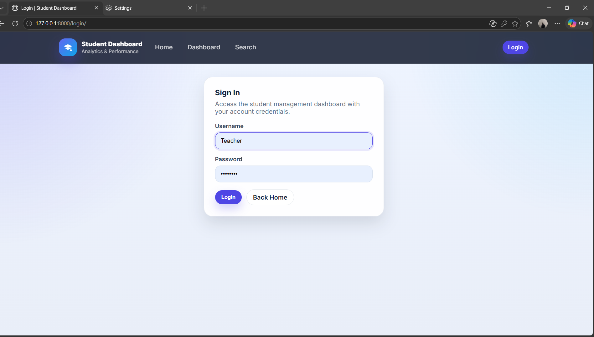
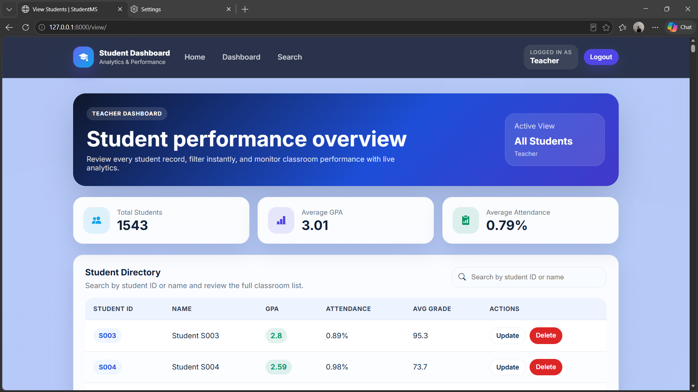
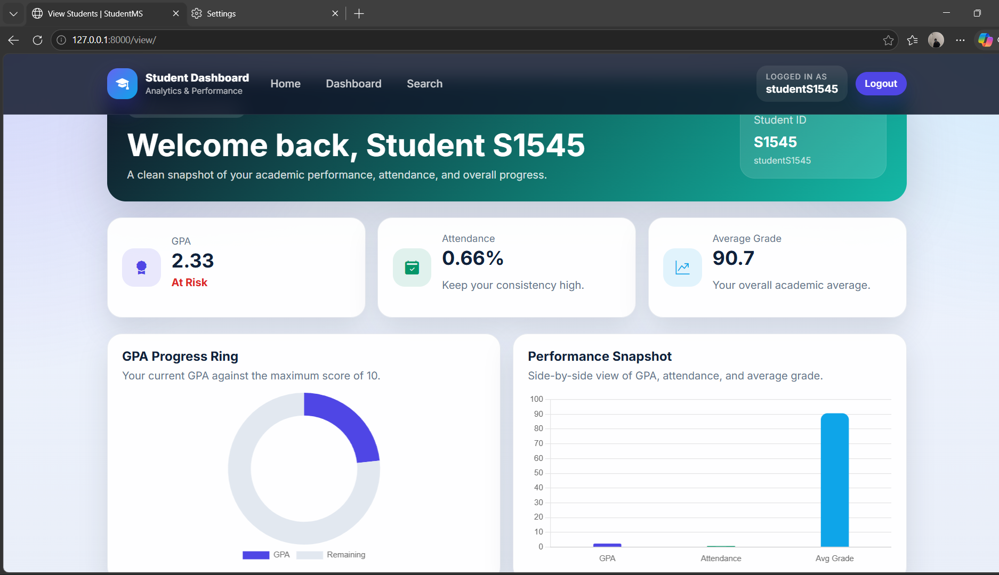
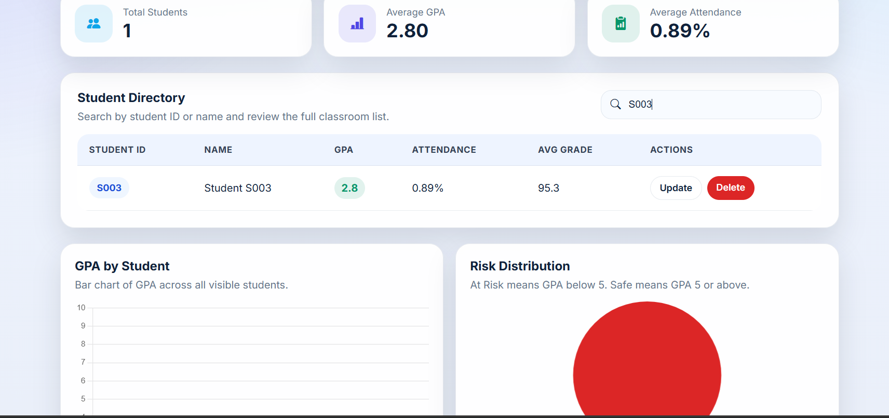

# 🎓 Student Management System

A role-based Student Management System built with Django that enables secure management of student records, academic performance tracking, attendance monitoring, and user authentication.

## 📌 Project Overview

This project was developed to streamline student record management in educational institutions. The system provides separate dashboards for Teachers and Students, allowing secure access to academic information, attendance records, and performance metrics through role-based authentication.

## 🚀 Features

### 👨‍🏫 Teacher Features

* View all student records
* Search students by Student ID
* Monitor GPA and attendance
* Update student information
* Delete student records
* Access administrative dashboard

### 👨‍🎓 Student Features

* Secure login system
* View personal profile
* Check GPA and attendance
* View academic performance metrics
* Access personalized dashboard

### 🔐 Authentication & Authorization

* Django Authentication System
* Role-Based Access Control (RBAC)
* Teacher and Student Groups
* Protected Routes using Login Required
* One-to-One User Profile Mapping

---

## 🛠️ Tech Stack

### Backend

* Python
* Django

### Frontend

* HTML
* CSS

### Database

* SQLite

### Tools

* Git
* GitHub
* VS Code

---
## 💡 Skills Demonstrated

- Backend Development with Django
- Authentication & Authorization
- Role-Based Access Control (RBAC)
- Database Modeling
- CRUD Operations
- CSV Data Processing
- Python Programming
- Git & GitHub Version Control

## 📊 Key Functionalities

* Student Record Management
* Authentication System
* Role-Based Dashboards
* GPA Calculation
* Attendance Tracking
* Student Search Functionality
* CSV Data Import
* Secure User Management

---

## 🏗️ Project Architecture

```text
User
 │
 ├── Teacher
 │     ├── View All Students
 │     ├── Search Students
 │     ├── Update Records
 │     └── Delete Records
 │
 └── Student
       ├── View Own Profile
       ├── View GPA
       ├── View Attendance
       └── Dashboard
```

## 📸 Screenshots

* Login Page

* Teacher Dashboard

* Student Dashboard

* Search Functionality


---

## ⚙️ Installation

### Clone Repository

```bash
git clone https://github.com/Ranveergade/StudentManagement_System
cd myapp/myapp
python manage.py runserver
```

### Create Virtual Environment

```bash
python -m venv venv
```

### Activate Virtual Environment

Windows:

```bash
venv\Scripts\activate
```

### Install Dependencies

```bash
pip install -r requirements.txt
```

### Apply Migrations

```bash
python manage.py migrate
```

### Run Server

```bash
python manage.py runserver
```

---

## 🔑 Demo Credentials

### Teacher Account

```text
Username: teacher
Password: root@123
```

### Student Account

```text
Username: studentS1545
Password: stuS1545
```

> Note: These are demo credentials created to showcase role-based functionality.

---

## 🎯 Learning Outcomes

Through this project, I gained practical experience in:

* Django Framework
* Authentication & Authorization
* Database Design
* CRUD Operations
* Role-Based Access Control
* MVC/MVT Architecture
* Git & GitHub Workflow
* Backend Development Best Practices

---

## 📂 Repository Structure

student-management-system/
├── stumgm/
├── templates/
├── static/
├── manage.py
├── requirements.txt
├── README.md
└── .gitignore

---

## 👨‍💻 Author

**Ranveer Gade**

B.Tech CSE Student
Python | Django | Machine Learning | AI Enthusiast

GitHub: https://github.com/ranveergade
